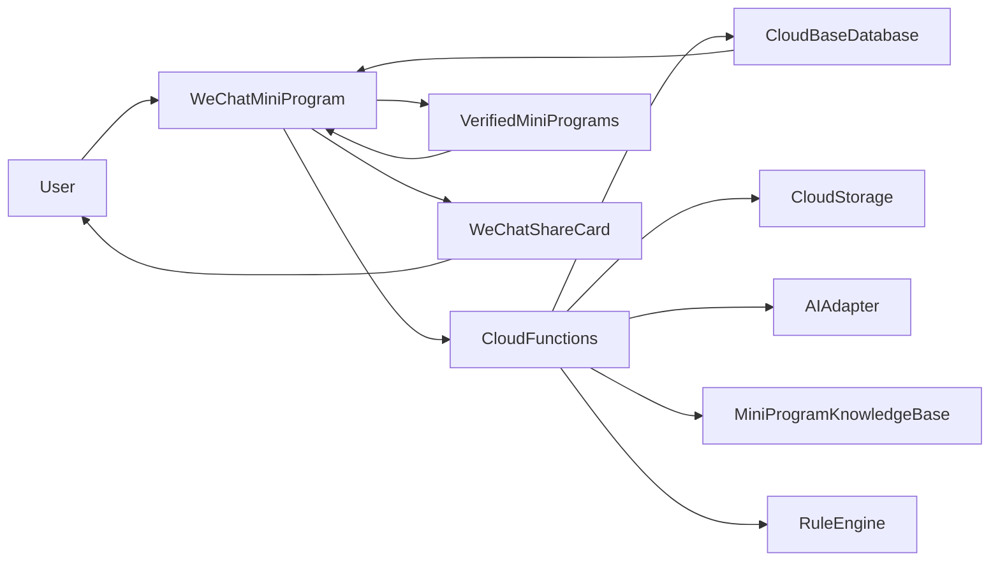
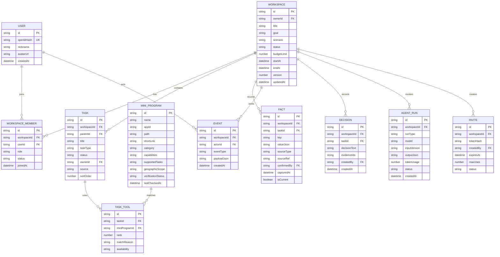
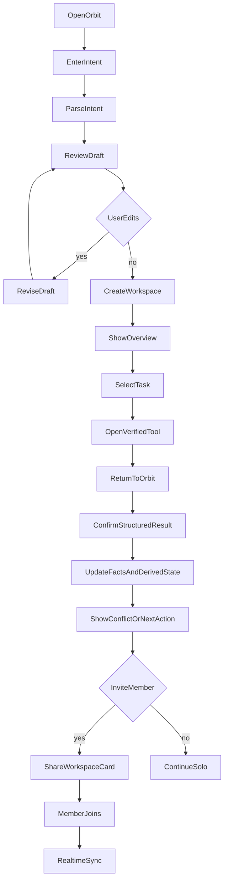
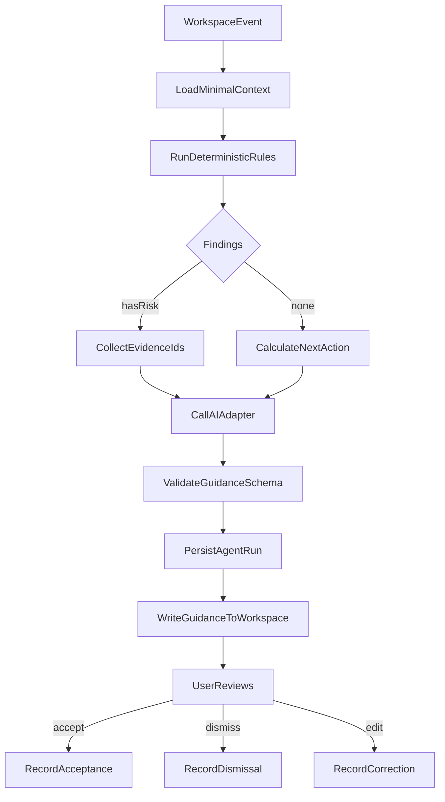
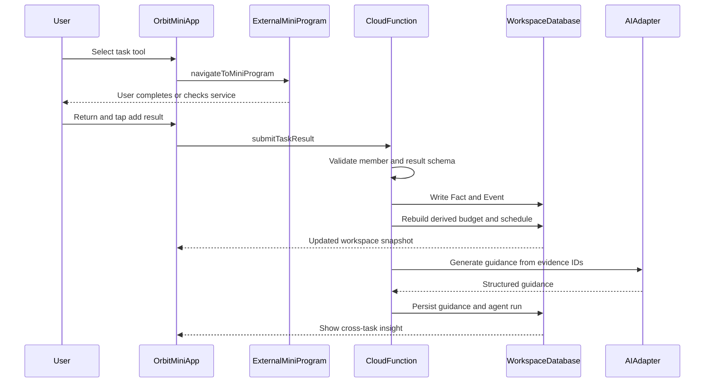

# AI Task Workspace Development Plan

**文档版本**：0.1  
**对应产品**：[PRD.md](./PRD.md)  
**目标**：用最小的可验证系统证明“Intent 可以被组织成 Workspace，多个微信工具可以围绕任务协作，统一 Context 可以产生跨任务建议”。  
**默认团队**：1–3 名开发者，原生微信小程序经验；工期按优先级调整，不把 Future 能力带入 MVP。

## 1. Implementation North Star

> 实现状态（2026-08-31）：Phase 0–5 的单人核心闭环代码、PostgreSQL schema、云函数和 fallback 已落地；外部小程序仍为 `pending`。当前微信开发者工具中的 AppID 尚未获得云开发调用权限，需开通/关联后完成小程序内真云端回归，不能将 Phase 0–5 标记为全部验收通过。

先交付一条可重复演示的垂直切片：

```text
文本 Intent
  -> 结构化确认
  -> 通用任务树
  -> 精选工具匹配
  -> 用户主动提交多个服务结果
  -> 预算与时间线更新
  -> 跨任务冲突建议
  -> 分享加入
  -> 第二设备实时同步
```

任何不能加强这条链路的工作都降级到 P1 或 Future。尤其不因为“看起来像 Agent”而引入不可控的自动下单、跨小程序抓取或向量检索。

## 2. Recommended Technical Stack

| 层 | MVP 选择 | 选择理由 | 备选/延期 |
| --- | --- | --- | --- |
| 小程序 | 微信原生小程序，TypeScript 可选 | 直接使用微信 API，减少框架适配风险 | Taro/uni-app 仅在团队已有成熟模板时考虑 |
| UI | 原生 WXML/WXSS + 自定义轻量组件 | 页面少、交互明确，便于真机调试 | 不为 MVP 引入完整 UI 框架 |
| 云端 | 微信云开发 CloudBase | 云函数、数据库、存储、微信身份和实时监听一体 | 需要特殊合规/运维时再迁移独立后端 |
| 数据库 | CloudBase PostgreSQL | 通过 `app.rdb()`/云函数访问，使用 PG schema、GRANT 和 RLS | NoSQL/watch 延期到协作阶段 |
| AI | 云函数中的 AI Adapter；优先验证 CloudBase AI | 隐藏密钥，统一结构化输出和成本控制 | 外部 LLM 通过同一 Adapter 接入 |
| 检索 | 结构化字段过滤 + 规则排序 | 精选知识库规模小、可解释、无需 embedding | 知识库超过数千条且语义检索确有收益时再用 Vector DB |
| 文件 | CloudBase 云存储 | 存储用户主动上传的截图/语音，带生命周期清理 | 不保存不必要的原始文件 |
| 语音 | 文本优先；P1 验证微信同声传译插件 | 语音不是核心假设，避免阻塞主链路 | 云端 ASR 需额外合规和成本评估 |
| 认证 | 微信 `wx.login` + 云函数可信上下文 | 不自建密码体系，符合小程序身份模型 | UnionID 只在有绑定开放平台和明确需求时使用 |
| 实时 | CloudBase `Collection.watch` | 满足两台设备同步，开发量小 | 高并发时再评估 WebSocket/独立实时服务 |
| 代码与发布 | Git + GitHub；微信开发者工具发布 | 便于协作、回滚和比赛材料留档 | 不在本计划中自动创建远程仓库 |

### 2.1 关键取舍

- **不使用 Vector DB**：MVP 知识库应保持几十到几百条可审查记录。结构化匹配能解释“为什么推荐”，也更容易阻止幻觉。
- **不把 LLM 放在前端**：所有模型调用经过云函数，前端只接收 schema 校验后的结果。
- **不把第三方小程序当后端**：跳转是用户体验入口，不是可信数据接口。结果回流默认由用户确认。
- **不做通用 Agent 工具调用**：Agent 只能调用内部白名单函数，外部跳转和敏感动作必须由用户点击。

## 3. System Architecture



### 3.1 模块边界

#### Mini Program App

- 首页、Intent 输入、计划确认；
- Workspace 概览、任务、预算、时间线、成员；
- 工具卡、跳转、结果确认表单；
- 事件和错误状态展示；
- 实时监听 Workspace 快照；
- 不保存 AppSecret、模型密钥或服务端权限判断。

#### Cloud Functions

- `authBootstrap`：从微信云上下文创建/更新用户；
- `createPlan`：解析 Intent，返回结构化计划草案；
- `revisePlan`：根据用户编辑生成新的计划版本；
- `matchTools`：按任务需求匹配精选知识库；
- `createWorkspace`：事务式创建 Workspace、任务和初始事实；
- `submitTaskResult`：校验并保存用户确认结果；
- `rebuildDerivedState`：计算预算、进度、时间线和风险；
- `runGuidance`：读取最小 Context，执行规则和生成 AI 文案；
- `inviteWorkspace` / `joinWorkspace`：邀请和成员关系；
- `getWorkspaceSnapshot`：返回当前用户有权读取的快照；
- `auditEvent`：记录不可变活动事件。

#### AI Adapter

统一以下接口：

```text
parseIntent(input, schemaVersion) -> IntentDraft
decomposeTask(intent, template, schemaVersion) -> PlanDraft
summarize(context, evidenceIds) -> SummaryDraft
generateGuidance(context, ruleFindings, evidenceIds) -> GuidanceDraft
```

Adapter 必须完成：

- JSON Schema 解析和校验；
- 模型超时、限流、空输出和非法 JSON 处理；
- 记录模型、耗时、token、错误码；
- 脱敏后再发送；
- 限制输入上下文大小；
- 禁止模型自行产生未在知识库中的 Mini Program ID。

#### Rule Engine

确定性规则优先于 LLM：

- `budget_total > budget_limit`；
- `arrival_at < check_in_at`；
- `task_dependency_not_done`；
- `unassigned_required_task`；
- `fact_expired`；
- `tool_unverified`。

## 4. Core Data Model

### 4.1 ER Diagram



### 4.2 CloudBase 集合

建议集合：

```text
users
workspaces
workspace_members
tasks
mini_programs
task_tools
facts
events
decisions
agent_runs
invites
notification_preferences
```

MVP 不强制把所有集合都开放给前端直接读写。优先通过云函数执行权限校验和关键写入，数据库安全规则作为第二层防线。

### 4.3 Facts 与 Events 设计

写入事实时必须同时产生事件：

```json
{
  "eventType": "fact.confirmed",
  "workspaceId": "ws_demo",
  "actorId": "user_1",
  "payload": {
    "factId": "fact_hotel_price",
    "key": "hotel.price",
    "value": 680,
    "currency": "CNY",
    "sourceType": "user_confirmed",
    "sourceRef": "manual_result_form"
  }
}
```

事件不可修改；更正通过新事件和新事实完成。这样可以解释 AI 为什么产生建议，也便于比赛演示“谁做了什么”。

## 5. API and Event Contracts

### 5.1 `createPlan`

输入：

```json
{
  "rawInput": "春节家人分散在不同城市，想一起回老家过年，安排交通、住宿、年货和家庭分工，预算6000",
  "inputMode": "text",
  "schemaVersion": "intent.v1"
}
```

输出：

```json
{
  "intent": {
    "goal": "异地家庭春节团聚",
    "participants": ["父母", "用户", "兄弟姐妹"],
    "origins": ["多个出发城市"],
    "destination": "老家",
    "serviceNeeds": ["transport", "lodging", "shopping", "meal"],
    "budgetLimit": 6000,
    "date": null
  },
  "assumptions": [
    "预算是否包含所有成员交通和年货待确认",
    "具体成员、城市和日期待确认"
  ],
  "taskDrafts": [
    {
      "title": "跨城交通",
      "taskType": "service_task",
      "requiredInputs": ["date", "participants", "origins", "destination"]
    }
  ],
  "needsConfirmation": true
}
```

### 5.2 `submitTaskResult`

结果 schema 由 Task 类型决定。通用服务结果至少需要：

```json
{
  "taskId": "task_family_meal",
  "result": {
    "serviceName": "家庭聚餐",
    "location": "老家城区",
    "startsAt": "2026-12-28T18:00:00+08:00",
    "price": 520,
    "participants": 4
  },
  "sourceType": "user_confirmed",
  "sourceRef": "mini_program_handoff"
}
```

服务端必须检查：

- 当前用户是 Workspace 成员；
- 当前用户有权修改该 Task；
- 字段类型、日期、金额和人数合法；
- 结果版本没有过期；
- 写入事实、事件和派生状态具有幂等键。

### 5.3 事件类型

```text
workspace.created
plan.confirmed
plan.revised
task.created
task.updated
task.assigned
task.completed
tool.opened
fact.proposed
fact.confirmed
fact.corrected
decision.recorded
member.invited
member.joined
guidance.generated
guidance.accepted
guidance.dismissed
```

## 6. Core Flows

### 6.1 User Flow



### 6.2 AI Agent Flow



### 6.3 Mini Program -> Workspace -> AI Context



关键约束：外部小程序不会被假设为 `C` 的数据源。`submitTaskResult` 的来源可以是用户确认、合作回传或内部演示适配器，但必须明确标注来源。

## 7. Mini Program Knowledge Base

### 7.1 数据分层

| 层 | 内容 | 更新方式 | 能否直接供 AI 选择 |
| --- | --- | --- | --- |
| Identity | 名称、AppID、path、shortLink | 人工核验 | 只有 verified 才能 |
| Capability | 支持任务、输入、输出 | 产品/开发维护 | 是 |
| Scope | 地域、时间、用户限制 | 人工核验 | 是 |
| Handoff | 跳转和回传方式 | 真机测试 | 是 |
| Volatile fact | 价格、余票、库存、营业时间 | 用户或合作方实时确认 | 不能作为静态事实 |
| Fallback | 搜索词、手动表单 | 人工维护 | 是 |

### 7.2 知识库工作流

1. 选择代表性场景中最少的 5–8 个能力；
2. 记录候选小程序的名称和官方来源；
3. 在目标 iOS/Android 真机验证打开路径；
4. 记录跳转前提、目标页、取消和下架情况；
5. 对每个候选建立输入/输出 schema；
6. 由第二人复核；
7. 发布前锁定版本；
8. 比赛前再次核验并保留 fallback。

### 7.3 推荐算法

先过滤再排序：

```text
1. taskType in supportedTasks
2. requiredInputs ⊆ knownIntentFields or manualCaptureEnabled
3. geography intersects destination
4. verificationStatus == verified
5. handoffMode is supported
6. compute explainable score
7. return top 1 primary + top 2 alternatives
```

推荐响应必须包含：

```text
miniProgramId
matchReason
missingInputs
expectedOutput
verificationStatus
fallback
```

### 7.4 场景模板注册表

场景模板只负责提供更好的初始任务建议，不能改变通用 Workspace 的数据结构。未知场景必须能使用 `generic_task` fallback 创建 Workspace。

模板接口：

```json
{
  "templateId": "new_year_reunion",
  "displayName": "异地过年",
  "triggerSignals": ["春节", "回老家", "家人团聚", "年货"],
  "defaultTaskTypes": ["service_task", "coordination_task", "decision_task", "tracking_task"],
  "defaultTasks": ["交通", "住宿", "年货", "预算", "家庭分工"],
  "requiredFacts": ["participants", "locations", "dateRange", "budgetLimit"],
  "optionalTasks": ["家庭聚餐", "到达与收货安排"],
  "version": "1.0.0"
}
```

模板实现顺序：

1. P0：`new_year_reunion`，用于验证跨城、购物、家庭协作；
2. P1：`moving_home`、`friend_gathering`、`family_affair`、`travel`；
3. Future：允许运营人员配置模板，但必须经过 schema 校验和知识库审核。

模板选择由规则和 LLM 的意图分类共同完成，但最终只返回已注册的 `templateId`。LLM 不得动态生成未经审核的任务模板。

## 8. AI Design and Cost Control

### 8.1 Prompt 分层

- System：角色、输出 schema、禁止事项；
- Template：当前场景任务定义和字段；
- Context：只发送当前 Workspace 必要事实；
- User input：最新用户内容；
- Evidence IDs：给建议引用的事实 ID。

不把完整事件表每次发送给模型。服务端先计算摘要：

```text
goal
confirmed facts
open tasks
current budget
schedule anchors
rule findings
recent user request
```

### 8.2 调用策略

- Intent 解析：创建 Workspace 时调用一次；
- 拆解修订：用户明确点击“重新规划”时调用；
- 工具匹配：规则查询，不调用 LLM；
- 预算/时间冲突：规则引擎先判断；
- 文案建议：有新事实或用户主动请求时调用；
- Summary：进入 Workspace 或发生关键变更时按需更新；
- 失败重试：最多一次，指数退避，不自动无限重试。

### 8.3 成本与性能预算

上线前在控制台记录每次 `AgentRun` 的：

- `inputTokens`、`outputTokens`；
- 模型和版本；
- 调用耗时；
- 失败和重试；
- Workspace 和功能类型。

产品约束：

- 单次请求 Context 限制在可控的摘要大小；
- 对相同 `contextVersion + runType` 做短时缓存；
- 只保留最近若干条用户事件给模型；
- 输出上限控制在短建议，不生成长攻略；
- P0 允许 AI 不可用时回退到规则文案；
- 比赛现场使用预置 Demo Workspace 和可重复输入，避免临时请求超时。

## 9. WeChat Technical Feasibility Matrix

以下结论基于截至 **2026-08-31** 可查阅的微信开放文档；“Confirmed”表示官方文档明确提供接口，不代表目标账号、基础库、审核状态或真实第三方小程序一定已具备条件。所有 Needs Verification 项必须在 Phase 0 真机和管理后台验证。

| 能力 | 状态 | 可用事实 | MVP 方案 |
| --- | --- | --- | --- |
| 小程序跳转 | Confirmed | `wx.navigateToMiniProgram` 支持 AppID、path、shortLink、extraData；需要用户触发，并可能出现确认弹窗 | 只跳转知识库中 verified 工具；跳转成功不等于任务完成 |
| 跳回原小程序 | Needs Verification | 目标小程序是否支持回跳、回传字段和版本行为取决于双方实现 | 默认用户手动返回 Orbit 并填写结果 |
| 读取其他小程序页面 | Not Available | 没有面向任意第三方页面的通用读取 API；不能抓页面、订单或登录态 | 用户主动确认、合作 API 或内部适配器 |
| 同主体云环境共享 | Confirmed / Needs Verification | 云开发支持同主体环境/资源共享，但不等于任意第三方数据可读 | 仅用于未来合作；MVP 不依赖 |
| 微信登录 | Confirmed | `wx.login` 获取 code，服务端换取 openid；云函数可获取可信上下文 | 以 openid 建立当前小程序用户 |
| 头像昵称 | Confirmed | 使用 chooseAvatar 和 nickname 输入组件；旧的 getUserProfile 不作为方案 | 允许用户主动填写，非核心登录条件 |
| 位置 | Confirmed / Needs Verification | `wx.getLocation` 可用，但要配置隐私、权限和 requiredPrivateInfos | MVP 手动输入城市；位置只做 P1 |
| 分享给好友/群 | Confirmed | `onShareAppMessage` 可配置 path/query；可带 shareTicket | 分享 Workspace 路径和短期邀请 token |
| 好友列表 | Not Available for MVP | 不以 API 直接读取用户好友列表或替用户选好友 | 用户点击微信分享面板自主选择 |
| 群身份 | Confirmed with limits | 群卡片场景可获取 openGid/group 信息，但有场景、版本和生命周期限制 | 不将 openGid 当成员身份；成员仍通过登录和邀请加入 |
| 多设备同步 | Confirmed | CloudBase 数据库支持 `Collection.watch` 实时推送，并受安全规则约束 | 监听当前 Workspace 的小集合，页面卸载时关闭 watcher |
| 订阅消息 | Confirmed with consent | 前端请求订阅，后端发送；模板和场景受后台配置限制 | P1；未授权时只显示页内提醒 |
| 语音输入 | Confirmed / Needs Verification | 微信同声传译插件提供实时流式识别，录音接口本身不等于 ASR | P0 文本；P1 验证插件与审核/权限 |
| web-view | Confirmed with constraints | 需 HTTPS、业务域名和备案，通信能力受限 | 不用 web-view 承载第三方小程序 |
| 全量小程序目录 | Not Available / Needs Verification | 不假设存在可直接使用的全生态公开目录 API；平台规则也限制未经允许建立目录 | 人工精选知识库和合作输入 |
| 微信云开发 AI | Confirmed with account risk | 官方文档提供 `wx.cloud.extend.AI`/Agent UI，但有基础库、资源和模型条件 | 云函数封装 Adapter；先验证账号和配额，保留外部模型 |
| 隐私授权 | Confirmed | 隐私指引、`wx.getPrivacySetting`/`wx.onNeedPrivacyAuthorization` 等机制 | 按需声明位置、录音、图片、剪贴板，不提前申请 |

### 9.1 官方核验链接

- [跳转其他小程序](https://developers.weixin.qq.com/miniprogram/dev/api/navigate/wx.navigateToMiniProgram.html)
- [小程序登录](https://developers.weixin.qq.com/miniprogram/dev/framework/open-ability/login.html)
- [云函数](https://developers.weixin.qq.com/miniprogram/dev/wxcloudservice/wxcloud/guide/functions.html)
- [CloudBase 实时数据推送](https://developers.weixin.qq.com/miniprogram/dev/wxcloudservice/wxcloud/guide/database/realtime.html)
- [数据库安全规则](https://developers.weixin.qq.com/miniprogram/dev/wxcloudservice/wxcloud/guide/database/security-rules.html)
- [小程序转发](https://developers.weixin.qq.com/miniprogram/dev/framework/open-ability/share.html)
- [群聊启动信息](https://developers.weixin.qq.com/miniprogram/dev/api/open-api/group/wx.getGroupEnterInfo.html)
- [订阅消息](https://developers.weixin.qq.com/miniprogram/dev/framework/open-ability/subscribe-message.html)
- [隐私协议开发指南](https://developers.weixin.qq.com/miniprogram/dev/framework/user-privacy/PrivacyAuthorize.html)
- [用户隐私保护指引](https://developers.weixin.qq.com/miniprogram/dev/framework/user-privacy/miniprogram-intro.html)
- [微信同声传译](https://developers.weixin.qq.com/miniprogram/dev/platform-capabilities/extended/translator.html)
- [微信云开发大模型接入](https://developers.weixin.qq.com/miniprogram/dev/wxcloudservice/wxcloud/guide/extensions/extend/ai/model)
- [业务域名与 web-view](https://developers.weixin.qq.com/miniprogram/dev/framework/ability/domain.html)
- [小程序平台原则及相关说明](https://developers.weixin.qq.com/miniprogram/product/)

## 10. Development Phases

每个 Phase 都按“Feature → Task → Subtask → Dependency → Expected Output → Acceptance Criteria”执行。完成标准不是代码提交，而是可在目标真机或测试环境中复现。

### Phase 0 — Research and Feasibility Gate

**Feature**：冻结 MVP 边界和真实 Demo 条件。

**Task**

- 确认小程序主体、类目、开发者权限、云开发环境；
- 确认基础库版本和 iOS/Android 测试设备；
- 核验 3–5 个真实工具的 AppID/path/shortLink；
- 验证 AI 通道、模型、额度、延迟和合规要求；
- 配置隐私指引、服务器域名、订阅模板的可行性；
- 记录所有失败路径和 fallback。

**Subtask**

1. 建立 `verification-log`，每项能力包含日期、账号、设备、步骤、结果；
2. 实测跳转、取消、回到 Orbit、页面状态恢复；
3. 实测 CloudBase `watch`、安全规则和第二设备登录；
4. 创建最小知识库 seed JSON；
5. 用 10 条跨场景真实用户输入测试 AI JSON 输出；
6. 冻结代表性模板的日期、价格和展示数据来源。

**Dependency**：微信开发者账号、目标小程序可访问、云开发权限。  
**Expected Output**：能力核验表、知识库初版、Demo 输入集、风险决策记录。  
**Acceptance Criteria**

- 至少 3 个工具入口在 iOS 和 Android 真机可验证，或明确标记 fallback；
- AI 通道连续成功 10 次且输出 schema 通过率 100%；
- 第二设备能登录同一测试 Workspace；
- 任何不可确认能力都没有进入 MVP 硬依赖。

### Phase 1 — Foundation

**Feature**：可运行的小程序骨架和安全云端基线。

**Task**

- 初始化项目、页面路由、环境配置；
- 接入 CloudBase；
- 实现微信登录和用户初始化；
- 建立数据库集合和最小安全规则；
- 建立错误码、日志和环境变量约定。

**Subtask**

1. 创建首页、创建页、Workspace 页占位；
2. 实现 `wx.cloud.init`；
3. 实现 `authBootstrap`；
4. 建立 `users/workspaces/workspace_members/events`；
5. 云函数统一返回 `{requestId, code, data, message}`；
6. 不把 AppSecret 和模型密钥写入前端。

**Dependency**：Phase 0 账号和 CloudBase。  
**Expected Output**：可登录、可创建测试用户、可访问受限集合的空壳。  
**Acceptance Criteria**

- 未登录请求被拒绝；
- 用户只能读取自己所属 Workspace；
- 关键写入经过云函数权限校验；
- 网络错误能显示可恢复文案和 requestId。

### Phase 2 — AI Intent

**Feature**：把自然语言变成可确认的通用 Intent Draft。

**Task**

- 定义 `intent.v1` JSON Schema；
- 接入 AI Adapter；
- 实现结构化字段展示和编辑；
- 处理缺失字段、歧义和模型失败。

**Subtask**

1. 编写中文系统提示词和负面约束；
2. 构造异地过年、搬家、聚会、家庭事务和旅行输入测试集；
3. 服务端校验日期、金额、人数、地域；
4. 前端展示 assumptions 和 missing fields；
5. 支持用户修正后保存；
6. 记录 `agent_runs`。

**Dependency**：Phase 1 AI 云函数。  
**Expected Output**：输入一句话后显示可编辑的目标、人数、地点、时间、预算和假设。  
**Acceptance Criteria**

- 10 条固定测试输入中，核心字段准确率达到团队定义的验收阈值；
- 缺失日期不会被模型填成虚构日期；
- 用户可以不接受 AI 草案而创建空白/手动 Workspace；
- 非法 JSON、超时和限流均有规则 fallback。

### Phase 3 — Task Decomposition

**Feature**：生成和编辑通用任务树。

**Task**

- 建立场景模板接口，并先实现异地过年模板；
- 生成任务、依赖、输入和输出；
- 支持任务增删改、排序、状态和负责人占位；
- 保存计划版本。

**Subtask**

1. 定义 `task.v1` schema；
2. 固定通用任务类型：服务、协作、决策、追踪；
3. 固定代表性模板任务：交通、住宿、年货、预算、家庭分工；
4. 实现 `plan.confirmed` 和 `plan.revised`；
5. 保持用户删除/新增记录；
6. 为每个任务生成手动结果表单 schema。

**Dependency**：Phase 2 Intent。  
**Expected Output**：用户确认后创建可编辑任务树。  
**Acceptance Criteria**

- 代表性模板输入至少生成 5 个核心任务；
- 搬家、聚会、家庭事务、旅行输入能落入通用 schema，即使尚未有专属模板；
- 删除的任务不会被普通刷新恢复；
- 任务状态只能通过用户或明确事件改变；
- 每个 P0 任务都有下一步和结果字段。

### Phase 4 — Mini Program Knowledge Base

**Feature**：从任务匹配可信的工具。

**Task**

- 录入精选知识库；
- 实现 capability filter 和 explainable ranking；
- 渲染工具卡；
- 实现跳转和失败兜底。

**Subtask**

1. 建立 `mini_programs` schema；
2. 加入交通、住宿、购物、本地生活、地图和记账等候选；
3. 每条记录设置 verification 状态；
4. 只允许 verified 记录产生跳转参数；
5. 实现无候选、被取消、不可跳转、下架文案；
6. 记录 `tool.opened`，但不自动完成任务。

**Dependency**：Phase 0 核验结果、Phase 3 task schema。  
**Expected Output**：每个代表性任务有主工具、替代工具或手动记录入口；未知场景仍有通用手动工具入口。  
**Acceptance Criteria**

- 推荐理由能说明任务、输入和能力匹配；
- 前端永远不接受模型直接返回的任意 AppID；
- 跳转取消后任务状态不变；
- 未核验候选只显示为待核验，不可点击直达。

### Phase 5 — Workspace Core

**Feature**：把任务、工具、事实和派生状态组织成 Workspace。

**Task**

- 实现 Workspace 创建和概览；
- 实现任务详情；
- 实现预算、行程、进度；
- 实现 Activity feed。

**Subtask**

1. 建立 Workspace 创建事务；
2. 按 `workspaceId` 查询任务和工具；
3. 实现任务状态机；
4. 实现结果确认表单；
5. 写入 Fact + Event；
6. 实现从事实重建派生状态。

**Dependency**：Phase 1–4。  
**Expected Output**：单人可从创建 Workspace 到提交第一个结果。  
**Acceptance Criteria**

- 刷新页面后事实、任务状态和预算保持一致；
- 用户能查看每项事实的来源和确认时间；
- 任务完成不因“打开工具”自动触发；
- Workspace 概览显示下一步而不是孤立卡片。

### Phase 6 — Mini Program Integration and Handoff

**Feature**：验证“工具属于任务”的跨场景跳转体验。

**Task**

- 代表性模板中的交通、住宿、购物/本地生活分别接入工具卡；
- 实现跳转前说明和返回后的结果确认；
- 为不可回传的小程序建立手动 capture；
- 为比赛准备一个明确标注的内部演示适配器。

**Subtask**

1. 为每个工具记录实际 path 和限制；
2. 跳转前保存 `pendingToolSession`；
3. `onShow` 恢复待确认状态；
4. 实现通用服务结果表单，并为交通、住宿、购物配置字段；
5. 保存来源 `handoffMode`；
6. 若使用内部适配器，UI 明确标注“演示数据/用户确认”。

**Dependency**：Phase 0 工具核验、Phase 5 Facts。  
**Expected Output**：完成外部工具动作后，用户能把任意结构化服务结果带回并更新 Workspace。  
**Acceptance Criteria**

- 目标小程序失败或取消后可以回到原任务；
- 结果需用户确认才写入；
- 任何自动回传都能显示来源；
- 无法使用第三方工具时，核心 Demo 仍可使用手动结构化结果。

### Phase 7 — AI Context and Guidance

**Feature**：基于 Workspace Context 产生跨任务建议。

**Task**

- 实现最小 Context builder；
- 实现预算/时间/依赖规则；
- 实现 AI Summary 和 Guidance；
- 保存建议证据和用户反馈。

**Subtask**

1. 构造 Context snapshot；
2. 实现服务时间、收货时间与聚餐时间不匹配的规则；
3. 实现预算超限和未分配任务规则；
4. AI 只接收证据 ID 和摘要；
5. 展示 suggestion、evidence、confidence；
6. 支持接受、忽略和纠正。

**Dependency**：Phase 5 Facts/Events、Phase 6 handoff。  
**Expected Output**：提交两个有时间或预算关系的服务结果后，系统产生跨任务建议。  
**Acceptance Criteria**

- 至少一个跨任务建议由两个已确认事实触发；
- 建议能回溯到事实；
- AI 不会把未确认候选当成已确认事实；
- 模型不可用时仍能显示确定性规则文案。

### Phase 8 — Collaboration

**Feature**：轻量多人 Workspace。

**Task**

- 实现分享路径和短期邀请；
- 实现 Owner/Member；
- 实现认领、分配、完成；
- 实现实时监听和同步状态。

**Subtask**

1. 生成邀请 token 的 hash；
2. 设置过期时间和使用次数；
3. 通过分享卡片传递 `workspaceId + inviteToken`；
4. 加入前验证登录和 token；
5. 限制 Member 可写字段；
6. 用 `watch` 监听 Workspace 变化并关闭 watcher。

**Dependency**：Phase 1 auth、Phase 5 Workspace、Phase 0 realtime 验证。  
**Expected Output**：第二设备加入后看到同一任务状态，第一设备能看到成员变化。  
**Acceptance Criteria**

- 过期/撤销邀请无法加入；
- 非成员无法读取 Workspace 标题、成员或事实；
- 第二设备在可接受延迟内看到任务/事实更新；
- 并发修改不会静默覆盖，冲突会提示或按版本拒绝。

### Phase 9 — Polish, Privacy, and Reliability

**Feature**：把原型变成可在比赛现场稳定运行的产品。

**Task**

- 真机兼容和性能；
- 隐私授权流程；
- 失败和离线状态；
- 埋点和演示重置；
- 成本、安全和数据清理。

**Subtask**

1. 检查所有网络域名、隐私声明和 API；
2. 测试冷启动、切后台、从外部小程序返回；
3. 测试弱网、AI 超时、watch 断开；
4. 建立 Demo data reset；
5. 压测单 Workspace 的读写和监听；
6. 清理日志中的敏感数据；
7. 设置 AI 调用预算告警。

**Dependency**：Phase 1–8。  
**Expected Output**：可从干净数据重复演示且失败可恢复。  
**Acceptance Criteria**

- iOS 和 Android 各完成完整 Demo；
- 不授权位置/录音/订阅时核心文本流程仍能完成；
- AI/网络失败不导致 Workspace 数据损坏；
- 所有关键错误都有用户可理解的下一步。

### Phase 10 — Competition Demo

**Feature**：用 3 分钟展示产品差异。

**Task**

- 固定演示脚本；
- 预置可核验数据；
- 准备双设备协作；
- 准备网络/跳转/模型故障备份；
- 录制视频和提交材料。

**Subtask**

1. 设备 A 创建异地过年 Workspace；
2. 展示交通、住宿、年货和家庭分工任务；
3. 写入交通和年货结果；
4. 展示预算/时间冲突或收货/聚餐依赖；
5. 分享并让设备 B 加入；
6. 设备 B 认领家庭聚餐；
7. 设备 A 展示实时变化；
8. 结尾回到产品对比。

**Dependency**：Phase 9。  
**Expected Output**：现场或录屏可在 180 秒内完成叙事。  
**Acceptance Criteria**

- 不需要临时搜索或输入复杂数据；
- 关键转场均有录屏或静态 fallback；
- 演示者能解释第三方数据边界而不夸大能力；
- 评委能看到至少一次跨任务 Context 建议和一次跨设备同步。

## 11. MVP Feature Checklist

### P0 产品

- [ ] 文本 Intent 输入
- [ ] Intent 结构化预览
- [ ] 用户确认和编辑
- [ ] 通用任务树
- [ ] 异地过年代表性模板
- [ ] 任务状态、负责人和依赖
- [ ] 精选 Mini Program Knowledge Base
- [ ] 工具卡推荐理由和核验状态
- [ ] 合法跳转或 fallback
- [ ] 用户主动提交至少两类服务结果
- [ ] Workspace 概览
- [ ] 预算和时间线
- [ ] Fact 来源和确认人
- [ ] Activity feed
- [ ] 时间冲突检测
- [ ] AI Summary / Guidance
- [ ] 分享加入
- [ ] Owner / Member 权限
- [ ] 第二设备实时同步

### P0 技术

- [ ] 微信登录
- [ ] 云函数权限校验
- [ ] 数据库安全规则
- [ ] AI JSON Schema 校验
- [ ] AI 超时和 fallback
- [ ] 事件幂等
- [ ] watcher 生命周期管理
- [ ] 关键日志和 requestId
- [ ] 隐私指引配置
- [ ] iOS/Android 真机验证

### P1

- [ ] 语音输入
- [ ] 图片/截图提取
- [ ] 订阅消息
- [ ] 评论
- [ ] 投票
- [ ] 搬家/聚会模板

## 12. Testing Strategy

### 单元测试

- Intent schema；
- 金额、日期、人数校验；
- capability matching；
- 预算计算；
- 时间冲突规则；
- 权限决策；
- invite token 过期和重复使用。

### 集成测试

- `createPlan -> createWorkspace`；
- `submitTaskResult -> rebuildDerivedState`；
- `fact.confirmed -> guidance`；
- `invite -> join -> member read`；
- `watch` 初始化、更新、断开和重连。

### AI 评测

固定 20 条中文输入，检查：

- schema 通过率；
- 核心字段抽取；
- 缺失信息是否诚实保留；
- 任务是否包含必需核心任务；
- 是否产生知识库外 AppID；
- 建议是否引用真实 fact；
- 输出长度、耗时和 token。

### 真机测试

- iOS / Android；
- 冷启动和热启动；
- 外部小程序跳转、取消、返回；
- 分享卡片单聊和群聊；
- 第二设备加入；
- 弱网、断网、后台恢复；
- 拒绝隐私、拒绝订阅、拒绝麦克风；
- 基础库版本差异。

## 13. Security and Privacy Checklist

- [ ] 不在前端保存 AppSecret、模型密钥或数据库管理员凭证
- [ ] 云函数从可信上下文得到 openid
- [ ] 所有 Workspace 查询验证成员关系
- [ ] invite token 只存 hash，设置过期和使用次数
- [ ] 不把 openGid 当作用户身份或授权凭证
- [ ] 不抓取第三方小程序页面、订单或会话
- [ ] 位置、录音、图片、剪贴板按需申明和授权
- [ ] 用户可查看和删除可删除的个人内容
- [ ] 日志脱敏
- [ ] AI 输入只发送必要字段
- [ ] AI 输出经过 schema、白名单和事实来源校验
- [ ] 外部 URL、AppID、path 只允许知识库白名单
- [ ] 预置 Demo 数据不包含真实个人信息

## 14. Technical Risk Register

| 风险 | 级别 | 影响 | 预防 | 触发后的降级 |
| --- | --- | --- | --- | --- |
| 第三方小程序 path 变化/下架 | 高 | Demo 无法跳转 | Phase 0 真机核验、发布前复核 | 搜索提示 + 手动结果表单 + 录屏 |
| 无法读取第三方订单 | 高 | 无法自动回传 | 产品承诺改为用户主动确认 | 合作 API 或结构化手动录入 |
| AI 输出幻觉 | 高 | 错误推荐和事实 | schema、知识库白名单、规则引擎 | 预置计划/规则文案 |
| AI 额度或延迟 | 高 | 首屏卡顿 | 摘要、缓存、超时、备用模型 | 本地模板和规则 fallback |
| 云开发 AI 账号条件不满足 | 中 | 模型调用失败 | Phase 0 验证并抽象 Adapter | 合规外部 LLM 云函数 |
| 实时监听权限配置错误 | 高 | 协作不更新或泄露 | 安全规则测试和最小查询 | 手动刷新和设备 B 录屏 |
| 分享邀请被转发滥用 | 中 | 越权访问 | 短期 token、Owner 审批、最大次数 | 关闭公共加入 |
| 隐私 API 未配置 | 高 | 真机调用失败 | 按需清单和隐私弹窗测试 | 不使用位置/录音/图片 |
| 个人账号不支持 web-view/某些能力 | 中 | 方案不可用 | 不把 web-view 作为依赖 | 原生页面和手动输入 |
| 比赛网络不稳定 | 高 | 现场演示中断 | 录屏、缓存、预置 Workspace | 离线演示 + 明确标注 |
| 多人并发覆盖 | 中 | 事实丢失 | version、幂等和冲突提示 | 服务端拒绝旧版本 |
| 用户误把打开当完成 | 中 | Context 不可信 | 只有确认表单可完成 | 任务保持进行中 |

## 15. Release Gates

### Gate A：进入核心开发

- Phase 0 通过；
- 至少一个 AI 通道可用；
- 至少三个工具入口已核验或有明确 fallback；
- CloudBase auth/database/watch 通过。

### Gate B：进入 Demo Polish

- 单人闭环通过；
- 两类服务事实能触发时间、预算或依赖冲突；
- 知识库、跳转、手动 capture 均有失败处理；
- 第二设备能加入并实时看到变化。

### Gate C：可参赛演示

- iOS/Android 完整演示通过；
- 无未确认的关键微信能力；
- 所有 AI 事实可引用；
- 有网络、模型、跳转失败备份；
- 预置数据无真实隐私信息；
- 3 分钟 storyboard 可稳定重复。

## 16. Recommended First Agent Tasks

以下任务可以直接交给 coding agent，按顺序执行：

1. 创建原生小程序骨架和 CloudBase 初始化；
2. 实现 `authBootstrap`、用户集合和安全规则；
3. 定义 `intent.v1`、`task.v1`、`fact.v1` JSON Schema；
4. 实现 `createPlan` mock 版本，先用异地过年输入跑通页面；
5. 实现 Intent 确认和任务树编辑；
6. 录入 5–8 条已核验知识库记录；
7. 实现 capability matching 和工具卡；
8. 实现 Workspace、Fact、Event 和预算派生状态；
9. 实现通用服务结果确认表单，并配置交通/住宿/购物字段；
10. 实现时间冲突规则；
11. 接入 AI Summary/Guidance Adapter；
12. 实现分享、邀请、成员权限和 `watch`；
13. 按真机清单修复生命周期和隐私问题；
14. 完成 Demo reset、埋点和故障 fallback。

## 17. Definition of Done

一个功能只有同时满足以下条件才算完成：

- 产品行为符合 [PRD.md](./PRD.md)；
- 有明确的输入、输出、权限和错误状态；
- 不依赖未核验的微信或第三方能力；
- 关键数据可追溯到 Fact/Event；
- AI 输出经过 schema 和白名单校验；
- iOS/Android 至少各验证一次；
- 有自动化测试或可重复的手工验收步骤；
- 不引入超出 MVP 的基础设施；
- 失败时仍有用户可执行的下一步。
